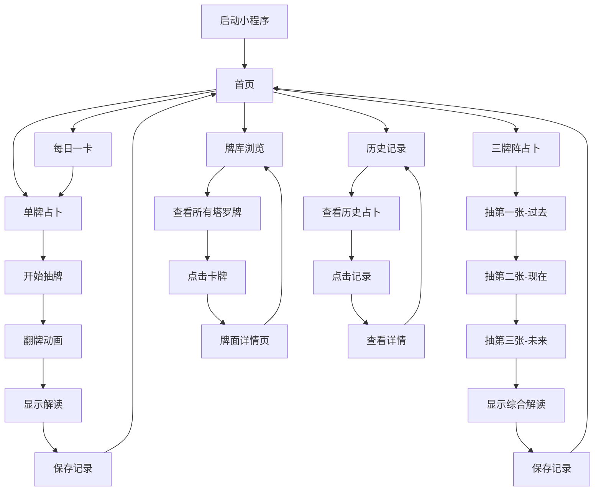

# 塔罗预言

## 一句话概述
一款神秘优雅的塔罗牌占卜小程序，帮助用户通过塔罗牌获得关于运势、感情、事业等方面的指引与启发。

## 用户画像与使用场景
**目标用户群体**：18-35岁对神秘学、占卜、心理探索感兴趣的年轻人

**核心使用场景**：
- 早晨起床后查看今日运势
- 遇到感情困惑时寻求指引
- 事业发展迷茫时获得启示
- 重要决策前的心理参考
- 探索自我内心的工具

## 小程序页面/组件与数据流规划

| 页面/组件名称 | 用途 | 核心功能 | 技术实现 | 导航/用户流程 | 文件路径 |
|:--------:|:----:|:--------:|:--------:|:--------:|:--------:|
| 首页 | 主导航入口 | 展示占卜方式选择、每日一卡、进入牌库 | 使用swiper展示卡片、navigator导航组件 | 启动页面，可跳转至各功能页 | pages/index/index |
| 牌库页面 | 浏览所有塔罗牌 | 展示78张塔罗牌（22张大阿卡纳+56张小阿卡纳），支持筛选 | scroll-view滚动视图、grid布局展示卡牌 | 从首页或tabBar进入，点击卡牌查看详情 | pages/card-library/card-library |
| 单牌占卜页面 | 抽取单张塔罗牌 | 随机抽取一张牌、翻牌动画、显示解读 | Math.random()随机算法、CSS3动画、本地数据读取 | 从首页进入，完成后可保存记录或重新占卜 | pages/single-card/single-card |
| 三牌阵占卜页面 | 过去-现在-未来占卜 | 依次抽取3张牌、展示牌阵、综合解读 | 分步抽牌逻辑、动画过渡、牌阵布局 | 从首页进入，完成后可保存或重新占卜 | pages/three-cards/three-cards |
| 牌面详情页 | 查看单张牌详细信息 | 显示牌面图片、正逆位含义、关键词、适用场景 | 页面传参接收cardId、本地JSON数据解析 | 从牌库或占卜结果页进入 | pages/card-detail/card-detail |
| 历史记录页面 | 查看占卜历史 | 展示历史占卜记录、可删除、可重新查看 | wx.getStorageSync读取本地存储、列表展示 | 从首页或tabBar进入，点击记录查看详情 | pages/history/history |
| 占卜结果组件 | 复用的结果展示 | 展示占卜结果、牌面解读、保存功能 | 自定义组件、接收父组件传值 | 在占卜页面中使用 | components/result-card/result-card |
| 塔罗牌卡片组件 | 复用的卡牌展示 | 统一的卡牌样式、翻转动画 | 自定义组件、CSS动画 | 多页面复用 | components/tarot-card/tarot-card |

## 功能清单与页面流程图



## 后端接口设计
**当前阶段**：暂不使用后端服务，所有数据采用本地存储方案。

**未来扩展**（可选使用微信云开发）：
- 用户登录与个人中心
- 云端同步占卜记录
- AI智能解读（调用云函数）

## 目录结构说明

```
tarot-miniprogram/
├── app.js                          # 小程序主逻辑
├── app.json                        # 小程序全局配置
├── app.wxss                        # 小程序全局样式
├── project.config.json             # 项目配置文件
├── sitemap.json                    # 站点地图配置
│
├── pages/                          # 页面目录
│   ├── index/                      # 首页
│   │   ├── index.js
│   │   ├── index.json
│   │   ├── index.wxml
│   │   └── index.wxss
│   │
│   ├── card-library/               # 牌库页面
│   │   ├── card-library.js
│   │   ├── card-library.json
│   │   ├── card-library.wxml
│   │   └── card-library.wxss
│   │
│   ├── single-card/                # 单牌占卜页面
│   │   ├── single-card.js
│   │   ├── single-card.json
│   │   ├── single-card.wxml
│   │   └── single-card.wxss
│   │
│   ├── three-cards/                # 三牌阵占卜页面
│   │   ├── three-cards.js
│   │   ├── three-cards.json
│   │   ├── three-cards.wxml
│   │   └── three-cards.wxss
│   │
│   ├── card-detail/                # 牌面详情页
│   │   ├── card-detail.js
│   │   ├── card-detail.json
│   │   ├── card-detail.wxml
│   │   └── card-detail.wxss
│   │
│   └── history/                    # 历史记录页面
│       ├── history.js
│       ├── history.json
│       ├── history.wxml
│       └── history.wxss
│
├── components/                     # 自定义组件目录
│   ├── tarot-card/                 # 塔罗牌卡片组件
│   │   ├── tarot-card.js
│   │   ├── tarot-card.json
│   │   ├── tarot-card.wxml
│   │   └── tarot-card.wxss
│   │
│   └── result-card/                # 占卜结果组件
│       ├── result-card.js
│       ├── result-card.json
│       ├── result-card.wxml
│       └── result-card.wxss
│
├── data/                           # 数据目录
│   ├── tarot-cards.js              # 塔罗牌完整数据（78张牌的信息）
│   └── card-meanings.js            # 牌面含义数据库
│
├── utils/                          # 工具函数目录
│   ├── storage.js                  # 本地存储封装
│   ├── card-shuffle.js             # 洗牌算法
│   └── date-format.js              # 日期格式化
│
└── static/                         # 静态资源目录
    ├── images/                     # 图片资源
    │   ├── cards/                  # 塔罗牌图片（78张）
    │   │   ├── major/              # 大阿卡纳（0-21）
    │   │   └── minor/              # 小阿卡纳（权杖、圣杯、宝剑、星币）
    │   ├── bg/                     # 背景图片
    │   └── icons/                  # 图标资源
    │
    └── audio/                      # 音效资源（可选）
        ├── flip.mp3                # 翻牌音效
        └── bg-music.mp3            # 背景音乐
```

## 数据存储方案

### 本地存储（wx.setStorageSync / wx.getStorageSync）
- **占卜历史记录**：存储键名 `divination_history`
  - 数据结构：数组，每条记录包含：时间戳、占卜类型、抽到的牌、解读内容
- **每日一卡记录**：存储键名 `daily_card`
  - 数据结构：对象，包含日期和当日卡牌

### 静态数据（本地JSON文件）
- **塔罗牌数据库**：`data/tarot-cards.js`
  - 78张塔罗牌的完整信息：编号、名称、图片路径、类别、关键词
- **牌面含义**：`data/card-meanings.js`
  - 每张牌的正位/逆位含义、适用场景、建议

### 云开发方案（可选，未来扩展）
- **云数据库**：用户占卜记录、用户偏好设置
- **云存储**：塔罗牌高清图片资源
- **云函数**：AI解读生成、每日运势推送

## 开发状态跟踪表

### 页面开发状态
| 页面名称 | 状态 | 备注 |
|:--------:|:----:|:----:|
| 首页 | 未开始 | - |
| 牌库页面 | 未开始 | - |
| 单牌占卜页面 | 未开始 | - |
| 三牌阵占卜页面 | 未开始 | - |
| 牌面详情页 | 未开始 | - |
| 历史记录页面 | 未开始 | - |

### 组件开发状态
| 组件名称 | 状态 | 备注 |
|:--------:|:----:|:----:|
| 塔罗牌卡片组件 | 未开始 | - |
| 占卜结果组件 | 未开始 | - |

### 数据准备状态
| 数据内容 | 状态 | 备注 |
|:--------:|:----:|:----:|
| 塔罗牌数据库 | 未开始 | 需要准备78张牌的完整信息 |
| 牌面含义数据 | 未开始 | 需要准备正逆位解读 |
| 塔罗牌图片资源 | 未开始 | 需要78张塔罗牌图片 |

## 页面技术方案

### 首页
*此部分将在页面开发阶段更新详细技术方案*

### 牌库页面
*此部分将在页面开发阶段更新详细技术方案*

### 单牌占卜页面
*此部分将在页面开发阶段更新详细技术方案*

### 三牌阵占卜页面
*此部分将在页面开发阶段更新详细技术方案*

### 牌面详情页
*此部分将在页面开发阶段更新详细技术方案*

### 历史记录页面
*此部分将在页面开发阶段更新详细技术方案*

## 快速启动步骤

### 1. 环境准备
- 下载并安装[微信开发者工具](https://developers.weixin.qq.com/miniprogram/dev/devtools/download.html)
- 注册微信小程序账号，获取AppID

### 2. 项目导入
- 打开微信开发者工具
- 选择"导入项目"
- 选择本项目目录
- 填入AppID（或使用测试号）

### 3. 本地开发
- 在微信开发者工具中预览各页面
- 使用模拟器或真机调试

### 4. 真机调试
- 点击开发者工具顶部"预览"按钮
- 使用微信扫码在真机上测试

### 5. 发布上线（可选）
- 代码开发完成后，点击"上传"
- 登录微信公众平台提交审核
- 审核通过后发布上线

## 可能遇到的坑及解决方案

### 1. 塔罗牌图片资源问题
**问题**：塔罗牌图片较多（78张），可能影响小程序包体积
**解决方案**：
- 压缩图片，使用WebP格式
- 首屏只加载必要图片，其他图片按需加载
- 考虑使用云存储存放高清大图

### 2. 随机抽牌算法
**问题**：需要确保抽牌的随机性和不重复
**解决方案**：
- 使用Fisher-Yates洗牌算法
- 每次占卜重新洗牌，确保随机性

### 3. 动画性能优化
**问题**：翻牌动画可能在低端设备上卡顿
**解决方案**：
- 使用CSS3硬件加速（transform3d）
- 避免在动画过程中频繁setData
- 使用wx.createAnimation优化动画性能

### 4. 本地存储限制
**问题**：微信小程序单个key存储上限10MB
**解决方案**：
- 历史记录设置上限（如最多保存100条）
- 超出限制时自动删除最旧记录
- 提供清空历史功能

### 5. 兼容性问题
**问题**：不同微信版本或设备的兼容性
**解决方案**：
- 在project.config.json中设置最低基础库版本
- 使用wx.getSystemInfo获取设备信息做适配
- 在真机上充分测试

### 6. 暗色主题适配
**问题**：需要实现优雅的暗色主题
**解决方案**：
- 使用CSS变量定义颜色主题
- 深色背景搭配霓虹色调
- 使用毛玻璃效果增强质感

---

**当前版本**：v1.0.0
**最后更新**：2025-11-22
**开发者**：Claude AI + 您
